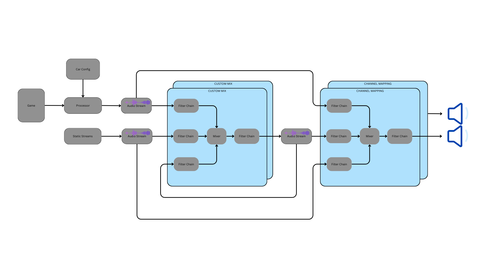
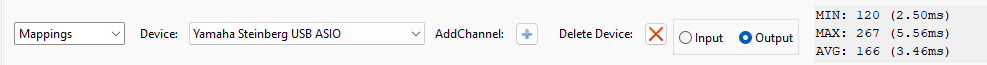

# irTactile

**irTactile** is a tool designed to generate audio output for driving bass shakers using telemetry data provided by racing simulators.

Initially, the main goal was to deliver highly realistic suspension effects. In the meantime, a full set of effects is already available:

1. **Suspension**  
   Highly realistic signal derived from suspension telemetry
2. **ABS**  
   Basic ABS vibration. The vibration frequency can be configured per car.
3. **Engine Vibrations**  
   Simple simulation of inline engines. The number of cylinders and tuning parameters are configurable per car.
4. **Gear Shifting**  
   Basic gear-shift emulation. Shift times can be configured per car.

---

## Supported Games

irTactile currently supports the following simulators:

- iRacing
- Automobilista 2
- Le Mans Ultimate
- rFactor 2
- Assetto Corsa
- Assetto Corsa Competizione
- Assetto Corsa EVO
- Assetto Rally
- Richard Burns Rally

---

## Key Advantages

The main advantages of irTactile compared to other applications are:

- Very realistic suspension signals
- Ultra-low latency, especially when using an ASIO-compatible audio device
- Extreme flexibility in composing the final signal
- Built-in filters that make external hardware/software solutions unnecessary
- Support for audio devices with more than 8 output channels

> ⚠️ **Note**  
> irTactile is currently in a very early **alpha** phase. Please do not expect all features to work perfectly.

---

# Concept

The core idea behind irTactile is to convert telemetry data provided by the simulator into multiple audio streams.  
These streams can be mixed and processed using various audio filters before being routed to specific output channels of an audio device.

---

## Getting Started

Running irTactile is straightforward:

1. **Extract the application**
2. **Select the audio driver**  
   On first launch, a prompt will open to select the audio device. This can also be done later using the editor.
3. **Configure outputs using `irTactile_editor`**  
   Assign streams to output channels and select the operating mode.
4. **Run irTactile**  
   The application can be started directly or via the editor.

> ⚠️ **Warning**  
> irTactile can generate signals that may damage bass shakers if misconfigured.

**Safety guidelines:**

- Ensure the audio device is configured correctly (see buffer configuration).
- Test without amplifiers or shakers connected.
- Verify that preview signals look reasonable.
- Connect amplifiers/shakers only after verification and increase volume slowly.
- When creating a custom profile, start from scratch and build up gradually:
  - Begin with suspension signals
    - Choose front/back or mixed suspension configuration
    - Apply appropriate low-pass/high-pass filters
    - Adjust gain
  - Add gear shift effects
  - Add engine vibrations
    - Engine signals work best when all four channels are used
    - Assign each signal to a shaker suitable for its frequency range
    - Adjust gain individually, then fine-tune collectively

A more advanced profile creation guide will be released in the future.

---

## Device Selection

When starting `irTactile.exe` for the first time, you will be prompted to select an output device.  
To re-run the configuration, delete `device_config.json` from the root directory.

Alternatively, device configuration can be launched from the editor under **Devices**.

### Driver Selection

For most consumer-grade devices, **WASAPI** is recommended.  
Starting with version **0.4.0**, ASIO-compatible devices are also supported.

### Device Selection

The selected device must support a **48 kHz** sampling rate.  
If a different rate is reported, irTactile will attempt to open the device at 48 kHz.  
If this is not supported, the application will exit and the sampling rate must be changed in Windows settings.

### Device Parameters

| Attribute | Description |
|---------|-------------|
| Name | Device name |
| Output Channels | Number of output channels (ASIO allows selecting a subset) |
| Input Channels | Number of input channels (ASIO allows selecting a subset) |
| Gain | Final output gain applied to the device |
| Exclusive Mode | WASAPI only. Bypasses Windows mixer and reduces latency |
| Clock Drift Compensation | Compensates clock differences between devices (increases CPU load) |
| Device Buffer Size | Size of chunks sent to/from the device |
| Application Buffer Size | Target internal buffer size |

---

## Output Device Tuning

Initial settings are chosen for compatibility, not minimum latency.

Available tuning options:

- Exclusive Mode (WASAPI)
- Device Buffer Size
- Application Buffer Size
- Clock Drift Compensation

For lowest latency:
1. Use **ASIO** if available
2. Otherwise, use **WASAPI Exclusive Mode**

Testing should be done with audible sine waves (20 Hz, 50 Hz, 100 Hz) while the simulator is running.

---

### Device Buffer Tuning

The goal is to find the smallest buffer size without audible artifacts.

- Start at **32 samples**
- Increase gradually until playback is clean
- Typical stable values: **32–64 samples**

> **Important:**  
> For ASIO devices, the buffer size must match the ASIO driver configuration.

---

### Application Buffer Tuning

The application buffer compensates for clock differences between signal generation and playback.

- Too large → unnecessary latency  
- Too small → buffer underruns and audible artifacts

The editor displays **MIN / MAX / AVG** buffer values and highlights underruns in red.

**Healthy buffer:**

**Buffer underrun:**

Start with **512–1024 samples**, then reduce gradually until underruns appear.

---

### Clock Drift Compensation

Use this option carefully:

- Increases CPU usage
- May introduce audible artifacts

Recommended values:
- **ASIO:** only as a last resort, values < 30  
- **WASAPI:** values up to ~50 may work

---

## System Streams

irTactile provides the following built-in streams:

### ABS_HR.\*
- ABS_HR.1: Base frequency
- ABS_HR.2: 2× base frequency
- ABS_HR.3: 3× base frequency
- ABS_HR.4: 4× base frequency

### GEAR.\*
- GEAR.1: Gear shift signal

### INPUTS.\*
- INPUTS.1: Throttle
- INPUTS.2: Brake
- INPUTS.3: Clutch

### STATUS.\*
- STATUS.1: ABS active
- STATUS.2: Velocity
- STATUS.3: Steering torque
- STATUS.4: Steering torque (with direction)

### SUSPENSION.\*
- Front Left
- Front Right
- Rear Left
- Rear Right

### ENGINE.\*
- ENGINE.1: Ultra-low frequency
- ENGINE.2: Low frequency
- ENGINE.3: Mid frequency
- ENGINE.4: High frequency

### WHEEL_SLIP.\*
- Front understeer (high/low frequency)
- Rear oversteer (low frequency)

### G_FORCES.\*
- Longitudinal
- Lateral
- Vertical

---

## Profiles

Profiles organize signal processing.  
They are optional for simple setups but strongly recommended for complex ones.

Each profile contains at least one **collection**:

| Section | Description |
|-------|-------------|
| Inputs | Device input routing |
| Mixer | Creation of new audio streams |
| Generators | Signal generators |
| Templates | Reusable filter chains |

---

## Audio Filters

The following filters can be used to modify audio streams:

- **Low-Pass Filter**  
  2nd-order Butterworth filter. Gain is reduced by 3 dB at the cutoff frequency.

- **High-Pass Filter**  
  2nd-order Butterworth filter. Gain is reduced by 3 dB at the cutoff frequency.

- **Peaking Filter**  
  Useful when the final mix has peaks beyond the clipping range.  
  Allows reducing peaks without lowering the overall volume.
  - **Frequency**: Center frequency
  - **Q Factor**: Controls the width/steepness of the filter
  - **Gain**: Boost or cut level

- **EQ**  
  Equalizer based on multiple peaking filters.  
  Filter sets generated with REW can be imported directly.

- **Gain**  
  Adjusts the gain of the signal.

- **Limiter**  
  Prevents peaks from exceeding the clipping range.
  - **Threshold**: Level at which the limiter starts working
  - **Gain**: Amount of gain reduction when above the threshold

- **Compressor**  
  Reduces the dynamic range of a signal.
  - **Threshold**: Level at which compression begins
  - **Ratio**: Gain reduction ratio above the threshold
  - **Attack**: Reaction time when the signal exceeds the threshold
  - **Release**: Reaction time when the signal falls below the threshold
  - **Gain**: Make-up gain after compression

- **Gate**  
  Filters out signals below a threshold.
  - **Threshold**: Signals below this level are attenuated
  - **Attack**: Reaction time when the signal exceeds the threshold
  - **Release**: Reaction time when the signal falls below the threshold
  - **Hold**: Duration the gate remains open after the signal falls below the threshold

- **Trigger**  
  Generates a control signal in the range **[0..1]** based on the input signal.
  - **Threshold**: Level at which the trigger activates
  - **Attack**: Reaction time when signal exceeds the threshold
  - **Release**: Reaction time when signal falls below the threshold
  - **Gain**: Output gain of the trigger signal
  - **Envelope**:  
    Enables envelope-following behavior instead of simple on/off triggering

- **Gamma**  
  Applies gamma correction to the signal.  
  This is a non-linear transformation and introduces distortion.
  - Values **> 1** reduce output for low amplitudes
  - Values **< 1** increase output for low amplitudes

- **Modulate**  
  Modulates the input signal using a second signal.

- **WaveSynth**  
  Generates a sine wave based on the input signal.

- **Sigmoid**  
  Non-linear dynamic range shaping filter.  
  Similar to gamma correction but with more control over the response curve.
  - **k**: Controls steepness
  - **a**: Controls symmetry
  - **x0**: Controls the midpoint of the response

Filters can be enabled or disabled individually, or the entire filter chain can be toggled on or off.

---

## Generators

Available generators:

- Sine waves
- Sweeps (constant amplitude, velocity, acceleration)
- Pink / White noise
- WAV file playback (48 kHz only)

---

## Channel Mapping

Streams must be routed to output channels to produce sound.

### Output Mapping

Allows routing and filtering similar to the mixer section.

### Input Mapping

Acts as a multiplexer.  
Channel-level filters apply globally; stream-level filters apply locally.

---

## Templates

Templates allow reuse of filter chains across multiple streams.  
Changes to a template propagate automatically to all linked streams.

---

## Car-Specific Configuration

A default configuration is created the first time a car is driven.

Configurable parameters include:

- Gear Shift
- Engine
- Suspension
- G-Forces
- Slip
- ABS

---
