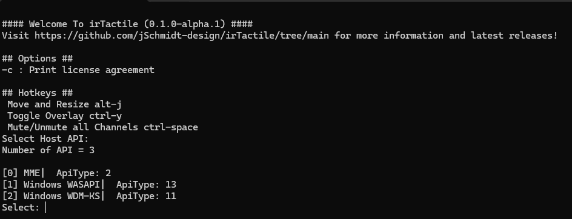
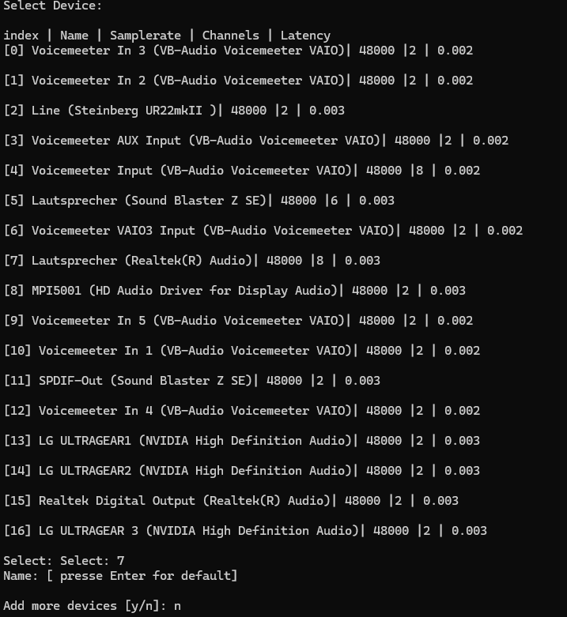
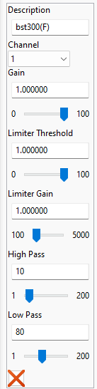
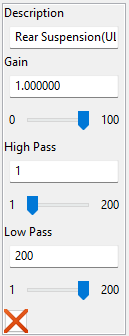

# irTactile 

irTactile is a tool designed to generate audio output to drive bass shakers using iRacing telemetry data.

Initially the goal was to provide the most realistic suspension effects, but in the mean time a full set effects is available. 

Simhub already does a great job, but since it is creating the effect based on simple sine waves, creating a complex signal requires quite a sophisticated setup which is not easy to maintain. On top there is quite some latency, which makes the effect to be out of sync compared to the actual force feed back, game audio and video. 

irTactile takes a different approach. It directly uses the suspension data from the iRacing telemetry, applies filters, and sends the processed signal to the audio device.
To keep the latency low WASAPI and ASIO APIs are being used. 

The results so far are promising. The wheel force feedback, regular audio, and bass shakers seem to be in sync.

The application is in a very early alpha phase. Please do not expect that everything is working perfectly. 

The software is currently closed source, but I will release the sources as soon as i find the time to cleanup the code. 

## Current Features

- Effects:
  - Suspension  
  Highly realistic signal based on suspension telemetry
  - Engine Vibration  
  Simple simulation of inline engine. Number of cylinders and some tuning parameters configurable per car.
  - ABS  
  Basic ABS vibration. Vibration frequency can be configured per car
  - Gear Shift  
  Basic Gear Shift emulation. Shift times can be configured per car. 
  - Slip (experimental)  
  Emulation of slip signal (over steer/ under steer). Similar to the tyre sound generated by iRacing. Requires per car specific configuration. Only few cars are enabled at the moment. 
- Audio output
  - Supported Drivers
    - WASAPI
    - WASAPI Exclusive Mode
    - ASIO (Experimental)
  - Signal Processing
    - Butterworth Low/High Pass filters per channel which makes usage of external equalizers obsolete. 
    - Flexible Mixing capabilities to output different signals through the same shaker
- Up to 16  audio channels can be visualized in real time to simplify profile design 
- Basic Editor to create/update the profiles
- Compatible with most cars in iRacing 
  - Whenever possible at least some basic configuration will be generated which can be tuned manually
  - Suspension effects might not work for some Formula cars which are not exposing data through the regular telemetry data. Prototypes are working, but require more fine tuning. 
  - Slip effect needs to be tuned manually for every car and is disabled by default. Currently the following cars have the proper configuration included
    - Mazda MX 5
    - Porsche 992 GT3 
    - Porsche 992 Cup
    - Mercedes AMG GT3 

# irTactile Documentation

## Getting Started

Running irTactile is straightforward. 

1. **Extract the application**
2. **Select the Audio Driver**
3. **Use irTactile_editor to assign the outputs to the channels**
4. **Run irTactile**

**Important: irTactile can potentially generate signals which can damage a shaker**

- Test first without amplifiers/shakers connected. 
- Make sure that the signals shown in the preview screen look good/reasonable
- When everything looks good connect the amps/shakers and slowly increase volume

## Device Selection
When you start the application for the first time, you will be prompted to select the output device. To re-run the configuration you have to delete device_config.json in the root directory.

First step of the configuration process is to select the driver. 
In general "WASAPI" should be selected, but there is also an experimental version which allows selection of ASIO which should allow even lower latencies.

In a second step the actual device can be selected.  

 

**In theory irTactile supports multiple output devices. But this is currently increasing highly the latency and is not recommended!**

## Channel Mapping

irTactile provides some predefined audio streams. Those streams have to assigned to the individual channels of a device. 
Even if there is only one physical device configured you can define multiple channel mappings. Just make sure, that there is only one mapping targeting the actual device. This allows simple switching between the mappings i.e. for testing without actually modifying the real mapping. 

Channel assignment involves two steps:
- Mixing some input sources
- Assigning the output to a channel
 
 It is possible to mix an arbitrary number of audio sources. For each source a gain factor can be defined. The gain factors should be selected in a way that the individual streams are present in the final mix with the desired intensity while maintaining the overall signal strength at a reasonable level without introducing clipping. Mixing itself is achieved by simply adding the individual sources. 

Out of the box the following streams are provided:
- **RearSuspension(MF)**: Rear Suspension signal Medium Frequency. Suitable for BST 300.
- **Rear Suspension(LF)**: Rear Suspension signal Low Frequency. Suitable for LFE/Q10B.
- **Rear Suspension(ULF)**: Rear Suspension signal Ultra Low Frequency. Suitable for Q10B.
- **Front Suspension(MF)**: Front Suspension signal Medium Frequency. Suitable for BST 300.
- **Front Suspension(ULF)**: Front Suspension signal Ultra Low Frequency. Suitable for Q10B.
- **Engine (MF)**: Engine signal Medium Frequency. Suitable for BST 300.
- **Engine (LF)**: Engine signal Low Frequency. Suitable for LFE/Q10B.
- **Gear**: Gear Shifting signal. Suitable for BST 300/LFE/Q10B.
- **ABS**: ABS  signal. Suitable for MQB1.
- **SlipFront(HF)**: Under steer signal High Frequency. Suitable for BST 300.
- **Slip Front(LF)**: Under steer signal Low Frequency. Suitable for LFE/Q10B.
- **Slip Rear(HF)**: Over steer signal High Frequency. Suitable for BST 300.
- **Slip Rear(LF)**: Over steer signal Low Frequency. Suitable for LFE/Q10B.
- **TestSignal(16Hz)**: Sine Wave 16 Hz.
- **TestSignal(50Hz)**: Sine Wave 50 Hz.

For each channel the following parameters can be adjusted:  

- Description  
Assign a name to identify the channel easily
- ChannelNr  
  Select the channel where the output should be routed.
  **Make sure that same channel is not selected multiple times!!!**
- Gain  
  Controls the final volume of the channel
- Limiter  
  In case the final mix might have peaks beyond the clipping range, this can be used to bring the peaks down without having to reduce the volume overall. 
  - Threshold  
    Controls when limiter starts working
  - Gain  
    Controls how much the gain should be reduced in case the signal is above the threshold
- HighPass Filter  (2nd order Butterworth. Gain reduction -3db at cutoff frequency)  
  Filters out frequencies below the provided value. 
- LowPass Filter (2nd order Butterworth. Gain reduction -3db at cutoff frequency)  
  Filters out frequencies above the provided value. 

**It is possible to provide more mappings than the channel number of the device. Again make sure that the real channels are referenced only once.**

## Audio Streams 

To modify existing streams or create new custom audio streams navigate to "Audio Streams" section.
The approach is very similar to channel mapping. But instead of assigning data to a channel a named stream is created. 
The sources for an audio stream are the actual data sources offered by irTactile. Those are currently:

- **ABS**: ABS indicator as provided by iRacing. Cannot be sent directly to a channel.
- **ABS_HR**: ABS signal.
  - Attribute 0: base frequency
  - Attribute 1: 2x base frequency
  - Attribute 2: 3x base frequency
  - Attribute 3: 4x base frequency
- **CLUTCH**: Clutch signal. Cannot be sent directly to a channel.
- **ROAD**: Suspension information to emulate road effects.
  - Attribute 0: Front Left
  - Attribute 1: Front Right
  - Attribute 2: Rear Left
  - Attribute 3: Rear Right
- **SUSPENSION**: Raw suspension information.
  - Attribute 0: Front Left
  - Attribute 1: Front Right
  - Attribute 2: Rear Left
  - Attribute 3: Rear Right
- **SUSPENSION_HF**: Suspension information with a moderate low-pass filter for shakers capable of outputting medium frequencies (e.g., BST300, BST1).
  - Attribute 0: Front Left
  - Attribute 1: Front Right
  - Attribute 2: Rear Left
  - Attribute 3: Rear Right
- **SUSPENSION_LFE**: Suspension information with a high low-pass filter for shakers capable of outputting low frequencies (e.g., BST300/LFE/Q10B).
  - Attribute 0: Front Left
  - Attribute 1: Front Right
  - Attribute 2: Rear Left
  - Attribute 3: Rear Right
- **SUSPENSION_q10**: Suspension information with a very high low-pass filter for shakers capable of outputting the lowest possible frequencies (e.g., LFE/Q10B).
  - Attribute 0: Front Left
  - Attribute 1: Front Right
  - Attribute 2: Rear Left
  - Attribute 3: Rear Right
- **ENGINE_HR**: Relative simple emulation of engine vibrations. Currently only inline engines are emulated.  
  - Attribute 0: Original Engine Signal
  - Attribute 1: 1/2 Frequency
  - Attribute 2: 1/4 Frequency
  - Attribute 3: 1/8 Frequency
- **WHEEL_SLIP**: Slip Signal. Since iRacing does not expose actual slip values. This is just an approximation. It provides similar feedback as turning up tires volume in iRacing.  
  - Attribute 0: Front Slip (under steer) high frequency
  - Attribute 1: Front Slip (under steer) low frequency
  - Attribute 2: Rear Slip (over steer) low frequency
  - Attribute 3: Rear Slip (over steer) low frequency

Finally for each stream the following parameters can be applied:

- Volume
- HighPass Filter  (2nd order Butterworth. Gain reduction -3db at cutoff frequency)  
  Filters out frequencies below the provided value. 
- LowPass Filter (2nd order Butterworth. Gain reduction -3db at cutoff frequency)  
  Filters out frequencies above the provided value. 

## Output Device Tuning
After the initial device selection basic settings are applied which should work on most systems but thy are not offering the lowest possible latency. 

irTactile provides the following tuning parameters:
- Exclusive Mode (when WASAPI is being used)
  - If enabled:
    - Windows internal mixer is by-passed
    - All audio enhancements are disabled (i.e. Equalizer APO)
    - Audio volume is only controlled by irTactile
  - Not supported by all devices
- Device Buffer Size
- (Application )Audio Buffer Size
- Latency Compensation

To achieve the lowest possible latency exclusive mode should be activated and all buffers sizes have to be reduced as much as possible without introducing distortion and/or clicking noises in the audio output. 

The simplest solution is to connect head phones or loudspeakers to the sound card, route an audible test signal the correct channel and then observe the output. The test can be initially performed in demo mode. But need to be repeated with iRacing running. 

1. Reduce Device Buffer size until the signal gets distorted or you hear clicking noises, then move one step back. 
   This defines the lower limit for the given device. 
   For ASIO this number should be ideally the same as it is configured for the output device in the ASIO driver. 
2. Reduce Application Buffer Size until the signal gets distorted or you hear clicking noises.
   The number needs to be at least as big as the Device Buffer Size.
3. If the Application Buffer Size is still much bigger than the device buffer turn up slowly the "Latency Compensation". If the signal gets clean again go back to step 2. Usually values around 10%-20% should be enough. 
4. Repeat steps 2 and 3 until Application Buffer size is equal to Device Buffer size or Latency Compensation > 50%. If The signal is not clean increase again Application Buffer size. 

## Car specific configuration

TBD

## Troubleshooting
 - After device selection, application exists immediately after start.
   Something wrong with the selected device.
    - Please delete `device_config.json` and choose a valid device.
 - No UI.
   Either the window has been disabled or moved in strange position.
    - Try deleting `config.json`.
- No signal 
  - Check if Demo Mode is active. 
- Soundblaster z SE not working in WASAPI exclusive mode.
  - Known issue with this sound card. Do not activate exclusive mode. 
- Changes in the editor are not reflected.
  - Make sure that "auto save" feature is enabled.
  - Changing device settings requires a restart of irTactile.
  - Check if there are multiple mappings to the same channel.
  
