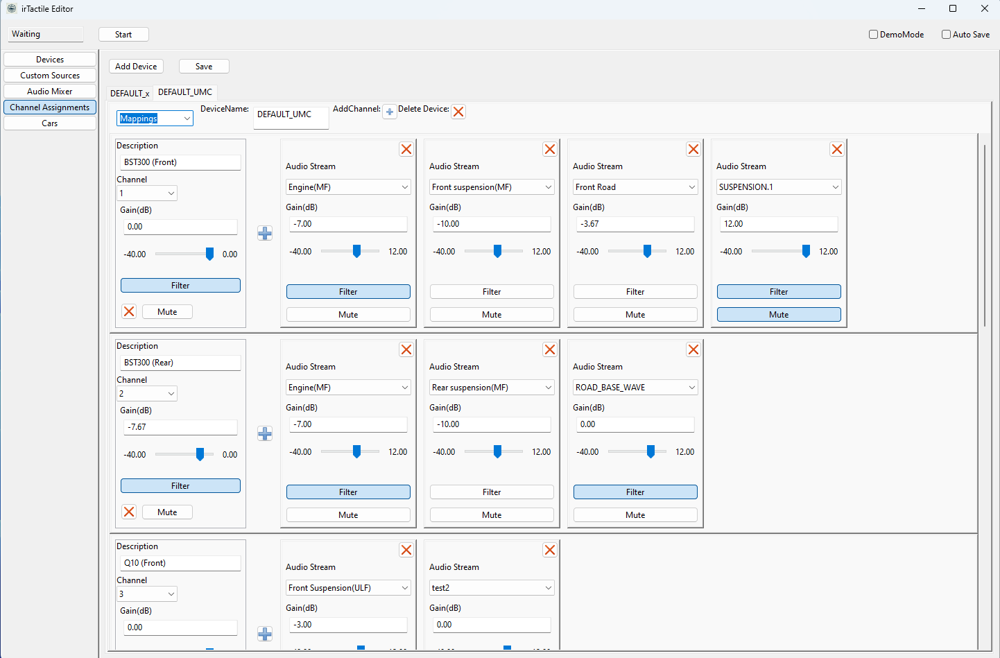
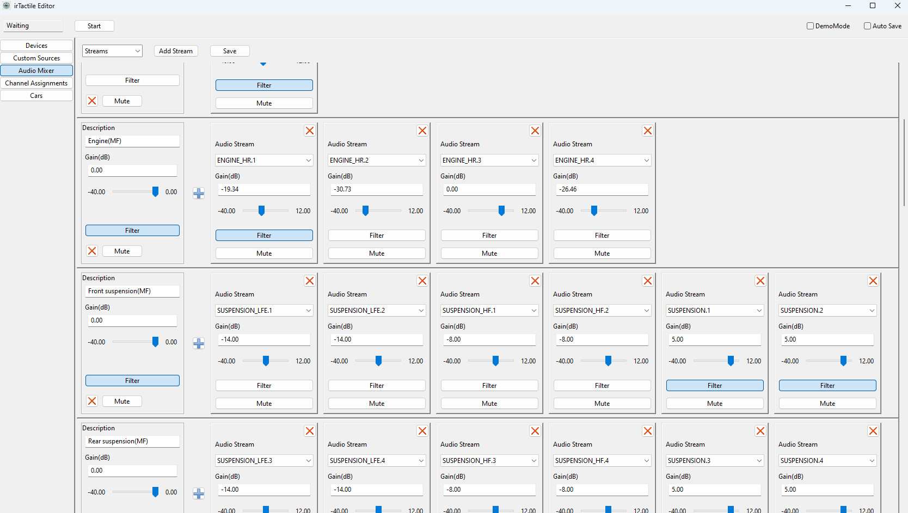

# irTactile 

irTactile is a tool designed to generate audio output to drive bass shakers using iRacing telemetry data.

Initially the goal was to provide the most realistic suspension effects, but in the mean time a full set effects is available:
1. Suspension\
  Highly realistic signal based on suspension telemetry
2. ABS\
  Basic ABS vibration. Vibration frequency can be configured per car
3. Engine Vibrations\
  Simple simulation of inline engine. Number of cylinders and some tuning parameters configurable per car.
4. Gear Shifting\
  Basic Gear Shift emulation. Shift times can be configured per car. 
5. Slip (Experimental)\
  Emulation of slip signal (over steer/ under steer). Similar to the tyre sound generated by iRacing. Requires per car specific configuration. Only few cars are enabled at the moment. 

The big advantages if irTactile compared with other application is:
- Very realistic suspension signal
- Ultra low latency
- Extreme flexibility to compose the final signal
- Built in filters which make external (hardware/software) solutions obsolete
- Supports for sound cards with more than 8 channels

The application is in a very early alpha phase. Please do not expect that everything is working perfectly. 

The software is currently closed source, but I will release the sources as soon as i find the time to cleanup the code. 

# irTactile Documentation
irTactile can be executed in three different modes:

1. Live Mode\
   In this mode the application waits for an active iRacing sessions. iRacing has to be running and the car must be on track. 
2. Replay Mode (Demo mode checked and replay file selected)\
   In this mode an output will be generated based on a pre recorded file. iRacing is not required to run.
3. Demo mode (Demo mode checked and no replay file selected)\
   In this mode only output based on the "static" wave files is generated. All other signals are zero. 

## Getting Started

Running irTactile is straightforward. 

1. **Extract the application**
2. **Select the Audio Driver**\
   When irTactile is executed for the first time, a prompt will open to select the device or Editor can be used.
3. **Use irTactile_editor to assign the outputs to the channels and select the operation mode**
4. **Run irTactile**\
   Can be started directly or from the editor

**Important: irTactile can potentially generate signals which can damage a shaker**

- Test first without amplifiers/shakers connected. 
- Make sure that the signals shown in the preview screen look good/reasonable
- When everything looks good connect the amps/shakers and slowly increase volume

## Device Selection
When you start irTactile.exe for the first time, you will be prompted to select the output device. To re-run the configuration you have to delete device_config.json in the root directory.
Alternatively you can launch device configuration from the editor in the "Devices" section as well. 

First step of the configuration process is to select the driver. 
In general "WASAPI" should be selected.

In a second step the actual device can be selected. For irTactile the device needs to support 48k sampling rate. If you select a device which shows a different number, irTactile will try to open the device with 48k anyhow. If this is not supported by the device, the application will terminate. In this case the sampling rate should be changed in windows settings.  

In the last some device parameters can be configured. Check Output Device Tuning for more details. 

## Channel Mapping

irTactile works like an audio mixer console. To get any output the available audio sources have to be routed to a channel of a specific audio device. 
Even if there is only one physical device configured it is possible to define multiple channel mappings. But only the mapping which points to the currently configred audio device will be active. This allows simple switching between the mappings i.e. for testing without actually modifying the real mapping. 

Channel mapping not only allows to route a stream to a channel. It is also possible to apply filters and or mix multiple audio streams. More details are provided in the Audio Mixer section. 

When mixing multiple streams the gain factors should be selected in a way that the individual streams are present in the final mix with the desired intensity while maintaining the overall signal strength at a reasonable level without introducing clipping. 

Out of the box the following streams are provided:
- **ABS_HR.\***: ABS signal.
  - ABS_HR.1: base frequency
  - ABS_HR.2: 2x base frequency
  - ABS_HR.3: 3x base frequency
  - ABS_HR.4: 4x base frequency
- **GEAR.\***: Gear shifting Signal.
  - GEAR.1: Gear signal
  - GEAR.2: -
  - GEAR.3: .
  - GEAR.4: -
- **INPUTS.\***: User Input.
  - INPUTS.1: Throttle
  - INPUTS.2: Brake
  - INPUTS.3: Clutch
  - INPUTS.4: -
- **STATUS.\***: Status attributes.
  - STATUS.1: Velocity
  - STATUS.2: ABS Active
  - STATUS.3: Steering Tourque
  - STATUS.4: Steering Tourque (including direction)
- **SUSPENSION_VELOCITY.\***: Experimental signal based on suspension velocity.
  - SUSPENSION_VELOCITY.1: Front Left
  - SUSPENSION_VELOCITY.2: Front Right
  - SUSPENSION_VELOCITY.3: Rear Left
  - SUSPENSION_VELOCITY.4: Rear Right
- **SUSPENSION_DEFLECTION.\***: Experimental signal based on suspension deflection.
  - SUSPENSION_DEFLECTION.1: Front Left
  - SUSPENSION_DEFLECTION.2: Front Right
  - SUSPENSION_DEFLECTION.3: Rear Left
  - SUSPENSION_DEFLECTION.4: Rear Right
- **SUSPENSION.\***: Raw suspension information.
  - SUSPENSION.1: Front Left
  - SUSPENSION.2: Front Right
  - SUSPENSION.3: Rear Left
  - SUSPENSION.4: Rear Right
- **ROAD.\***: Suspension information to emulate road effects.
  - ROAD.1: Front Left
  - ROAD.2: Front Right
  - ROAD.3: Rear Left
  - ROAD.4  Rear Right
- **SUSPENSION_HF.\***: Suspension information which emphesize high frequencies for shakers capable of outputting medium to high frequencies (e.g., BST300, BST1).
  - SUSPENSION_HF.1: Front Left
  - SUSPENSION_HF.2: Front Right
  - SUSPENSION_HF.3: Rear Left
  - SUSPENSION_HF.4: Rear Right
- **SUSPENSION_LFE.\***: Suspension information which emphesize low frequencies for shakers capable of outputting low frequencies (e.g., BST300/LFE/Q10B).
  - SUSPENSION_LFE.1: Front Left
  - SUSPENSION_LFE.2: Front Right
  - SUSPENSION_LFE.3: Rear Left
  - SUSPENSION_LFE.4: Rear Right
- **SUSPENSION_q10.\***: Suspension information which emphesize ultra low frequencies for shakers capable of outputting very low frequencies (e.g., LFE/Q10B).
  - SUSPENSION_q10.1: Front Left
  - SUSPENSION_q10.2: Front Right
  - SUSPENSION_q10.3: Rear Left
  - SUSPENSION_q10.4: Rear Right
- **ENGINE_HR.\***: Relative simple emulation of engine vibrations. Currently only inline engines are emulated.  
  - ENGINE_HR.1: Original Engine Signal
  - ENGINE_HR.2: 1/2 Frequency
  - ENGINE_HR.3: 1/4 Frequency
  - ENGINE_HR.4: 1/8 Frequency
- **WHEEL_SLIP.\***: Slip Signal. Since iRacing does not expose actual slip values. This is just an approximation. It provides similar feedback as turning up tires volume in iRacing.  
  - WHEEL_SLIP.1: Front Slip (under steer) high frequency
  - WHEEL_SLIP.2: Front Slip (under steer) low frequency
  - WHEEL_SLIP.3: Rear Slip (over steer) low frequency
  - WHEEL_SLIP.4: Rear Slip (over steer) low frequency
- **G_FORCES.\***: G-Force data as exposed by iRacing.  
  - G_FORCES.1: Longitudinal G-Forces
  - G_FORCES.2: Lateral G-Forces
  - G_FORCES.3: Vertical G-Forces
  - G_FORCES.4: unused

Additional streams can be created in the Audio Mixer or by defining static streams. 

**It is possible to provide more mappings than the channel number of the device. Again make sure that the real channels are referenced only once.**

## Audio Mixer 

Audio Mixer allows creation of additional streams. Each stream is a mix of any other combination of input streams and filters. 

Filters can be assinged to the individual streams and globally for the final output. 

Out of the box the following streams are provided:
- **RearSuspension(MF)**: Rear Suspension signal Medium Frequency. Suitable for BST 300.
- **Rear Suspension(LF)**: Rear Suspension signal Low Frequency. Suitable for LFE/Q10B.
- **Rear Suspension(ULF)**: Rear Suspension signal Ultra Low Frequency. Suitable for Q10B.
- **Front Suspension(MF)**: Front Suspension signal Medium Frequency. Suitable for BST 300.
- **Front Suspension(ULF)**: Front Suspension signal Ultra Low Frequency. Suitable for Q10B.
- **Engine (MF)**: Engine signal Medium Frequency. Suitable for BST 300.
- **Engine (LF)**: Engine signal Low Frequency. Suitable for LFE/Q10B.
- **Gear**: Gear Shifting signal. Suitable for BST 300/LFE/Q10B.
- **ABS**: ABS  signal. Suitable for MQB1.
- **SlipFront(HF)**: Under steer signal High Frequency. Suitable for BST 300.
- **Slip Front(LF)**: Under steer signal Low Frequency. Suitable for LFE/Q10B.
- **Slip Rear(HF)**: Over steer signal High Frequency. Suitable for BST 300.
- **Slip Rear(LF)**: Over steer signal Low Frequency. Suitable for LFE/Q10B.
- **TestSignal(16Hz)**: Sine Wave 16 Hz.
- **TestSignal(50Hz)**: Sine Wave 50 Hz.

## Audio Filter 
 

As of now the following filters can be used to modify the stream:
- **Low Pass**: 2nd order Butterworth. Gain reduction -3db at cutoff frequency.
- **High Pass**: 2nd order Butterworth. Gain reduction -3db at cutoff frequency.
- **Peaking Filter**: In case the final mix might have peaks beyond the clipping range, this can be used to bring the peaks down without having to reduce the volume overall. 
  - **Frequency**: Center frequency.
  - **Q Factor**: Q controls the width/steepness of the filter.
  - **Gain**: Boost/Cut.
- **EQ**: An Equalizer based on multiple peaking filters. REW generated filter can be directly imported.
- **Limiter**: In case the final mix might have peaks beyond the clipping range, this can be used to bring the peaks down without having to reduce the volume overall. 
  - **Threshold**
    Controls when limiter starts working
  - **Gain**
    Controls how much the gain should be reduced in case the signal is above the threshold
- **Gamma**: Applies a gamma correction to the signal. As this is a non linear transformation, distortion is introduced.
Values >1 will reduce the output volume of low amplitudes. Values < 1 will increase the output for low amplitudes.
- **Modulate**: Allows to modulate the input signal with a second signal. 
- **WaveSynth**: Generate a sinus wave based on the input signal.
- **Sigmoid**: Similar to Gamma correction this filters allows to change the dynamic range of the input signal. As this is a non linear transformation distortion is introduced. The shape of the response function can be controlled with three parameters:
  -  **k**
    Controls the steepness 
  -  **a**
    Controls the symmetry
  -  **x0**
    Controls the mid point

Filters can be activated/deactivated individually or the whole filter chain can turned on/off.
  
## Custom Sources

In addition to custom mixes it is also possible to define static sinus wave which can be used as audio sources in any mix. 
Three types of sources are supported:
- **Sine waves**: Basic Sine wave.
- **Sweeps**: Three different sweeps can be selected.
  -  Sweep with constant amplitude
  -  Sweep with constant velocity
  -  Sweep with constant acceleration
- **Noise**: Pink/White Noise.

## Output Device Tuning
After the initial device selection basic settings are applied which should work on most systems but thy are not offering the lowest possible latency. 

irTactile provides the following tuning parameters:
- Exclusive Mode (when WASAPI is being used)
  - If enabled:
    - Windows internal mixer is by-passed
    - All audio enhancements are disabled (i.e. Equalizer APO)
    - Audio volume is only controlled by irTactile
  - Not supported by all devices
- Device Buffer Size
- (Application )Audio Buffer Size
- Latency Compensation

To achieve the lowest possible latency exclusive mode should be activated and all buffers sizes have to be reduced as much as possible without introducing distortion and/or clicking noises in the audio output. 

The simplest solution is to connect head phones or loudspeakers to the sound card, route an audible test signal the correct channel and then observe the output. The test can be initially performed in demo mode. But need to be repeated with iRacing running. 

1. Reduce Device Buffer size until the signal gets distorted or you hear clicking noises, then move one step back. 
   This defines the lower limit for the given device. 
   For ASIO this number should be ideally the same as it is configured for the output device in the ASIO driver. 
2. Reduce Application Buffer Size until the signal gets distorted or you hear clicking noises.
   The number needs to be at least as big as the Device Buffer Size.
3. If the Application Buffer Size is still much bigger than the device buffer turn up slowly the "Latency Compensation". If the signal gets clean again go back to step 2. Usually values around 10%-20% should be enough. 
4. Repeat steps 2 and 3 until Application Buffer size is equal to Device Buffer size or Latency Compensation > 50%. If The signal is not clean increase again Application Buffer size. 

## Car specific configuration

As soon as a car is driven for the first time a default configuration file will be created. The individual parameters can be adjusted in the cars section of the editor. 

- **Gear Shift**
  - Shift Time: Controls the length of the shift impulse in milliseconds
  - Intensity: Controls the volume of the signal in dB
- **Engine**
  - Cylinder: Number of cylinders to be used for simulation
  - Pressure: Controls how the engine behaves under load. Lower values result in a rougher vibrations
  - Intensity: Controls the volume of the signal in dB
- **Suspension**
  - Max Acceleration: Defines the acceleration value of the impact on the suspension which will be mapped to max signal strength
  - Min Velocity: All suspension movements below the value will be ignored. 
  - Gamma: Values smaller 1 will amplify low movements. Values bigger 1 will reduce signal strength of small impacts
- **g Force**
  - Max longitudinal force:  Defines the acceleration value which will be mapped to max signal strength in g
  - Max lateral force: Defines the acceleration value which will be mapped to max signal strength in g
  - Max vertical force: Defines the acceleration value which will be mapped to max signal strength in g
- **Slip**
  - Max oversteer angle: Defines the oversteer angle in degrees which will be mapped to max signal strength
  - Max understeer angle: Defines the oversteer angle in degrees which will be mapped to max signal strength
  - Slip Factor: Magic number controls the zero point 
  - Slip Intensity: Controls the volume of the signal in dB
- **ABS Settings**
  - Frequency: Abs frequency in Hz
  - Intensity: Volume of the signal in dB 

## Troubleshooting
 - After device selection, application exists immediately after start.
   Something wrong with the selected device.
    - Please delete `device_config.json` and choose a valid device.
 - No UI.
   Either the window has been disabled or moved in strange position.
    - Try deleting `config.json`.
- No signal 
  - Check if Demo Mode is active.
  - Check if Channel mapping points to the correct device. 
- No sound signal even though demo mode is active
  - In demo mode only simple waves can be played. I.e. (TestSignal50Hz) 
- Soundblaster z SE not working in WASAPI exclusive mode.
  - Known issue with this sound card. Do not activate exclusive mode. 
- Changes in the editor are not reflected.
  - Make sure that "auto save" feature is enabled.
  - Changing device settings requires a restart of irTactile.
  - Check if there are multiple mappings to the same channel.
  
