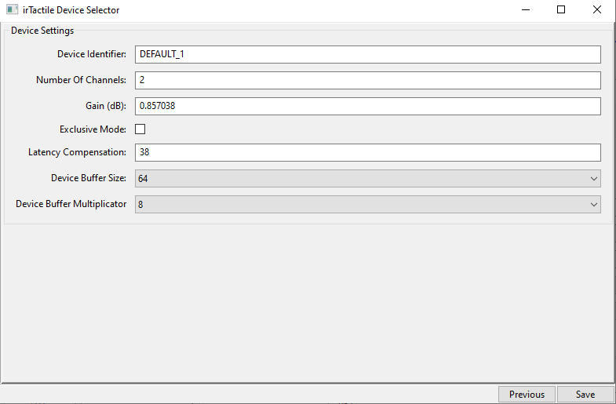

# irTactile 

irTactile is a tool designed to generate audio output to drive bass shakers using telemetry data provided by racing simulators.

Initially the goal was to provide the most realistic suspension effects, but in the mean time a full set effects is available:
1. Suspension\
  Highly realistic signal based on suspension telemetry
2. ABS\
  Basic ABS vibration. Vibration frequency can be configured per car
3. Engine Vibrations\
  Simple simulation of inline engine. Number of cylinders and some tuning parameters configurable per car.
4. Gear Shifting\
  Basic Gear Shift emulation. Shift times can be configured per car. 
5. Slip (Experimental)\
  Emulation of slip signal (over steer/ under steer). Similar to the tyre sound generated by iRacing. Requires per car specific configuration. Only few cars are enabled at the moment. 

With version 0.4.0 irTactile can be used for the following simulators
* iRacing
* Automobilista 2
* Le Mans Ultimate
* Assetto Corsa EVO

Version 0.5.0 introduced in addition
* Richard Burns Rally
  
The big advantages if irTactile compared with other application is:
- Very realistic suspension signal
- Ultra low latency
- Extreme flexibility to compose the final signal
- Built in filters which make external (hardware/software) solutions obsolete
- Supports for sound cards with more than 8 channels
- The application is ASIO compatible

NOTE: The application is in a very early alpha phase. Please do not expect that everything is working perfectly. 

# Concept

The basic idea of irTactile is to take the telemetry data offered by the simulator and convert it in a set of audio streams. 
The audio streams can then be mixed and processed by various audio filters before being send to a specific channel of the sound card. 

# irTactile Documentation
irTactile can be executed in three different modes:

1. Live Mode\
   In this mode the application waits for an active iRacing sessions. Simulator has to be running and the car must be on track. 
2. Replay Mode (Demo mode checked and replay file selected)\
   In this mode an output will be generated based on a pre recorded file. Simulator is not required to run. Only supported for iRacing. 
3. Demo mode (Demo mode checked and no replay file selected)\
   In this mode only output based on the "static" signals are being played All other signals are silenced. Simulator is not required to run.

## Getting Started

Running irTactile is straightforward. 

1. **Extract the application**
2. **Select the Audio Driver**\
   When irTactile is executed for the first time, a prompt will open to select the device or Editor can be used.
3. **Use irTactile_editor to assign the outputs to the channels and select the operation mode**
4. **Run irTactile**\
   Can be started directly or from the editor

**Important: irTactile can potentially generate signals which can damage a shaker**

- Make sure that audio device is configured correctly. See the buffer configuration chapter for details.
- Test first without amplifiers/shakers connected. 
- Make sure that the signals shown in the preview screen look good/reasonable.
- When everything looks good connect the amps/shakers and slowly increase volume.
- If not using a prebuilt profile, it is best to start from scratch and slowly improve the setup.
  - Start with suspension first. 
    - Depending on configuration go with front/back configuration or mix all 4 suspension signals.
    - Apply LP/HP filters which are matching the used shakers
    - Adjust the gain.
  - Add Gear
  - Add Engine
    - Engine works best when all 4 signals are being used.
    - Assign the first signal to the shaker suitable for the given frequency range and adjust the gain. 
    - Repeat for all other signals individually
    - Activate all 4 signals and perform fine tuning

A more advanced guideline for profile creation will be released in the future.

## Device Selection
When you start irTactile.exe for the first time, you will be prompted to select the output device. To re-run the configuration you have to delete device_config.json in the root directory.
Alternatively you can launch device configuration from the editor in the "Devices" section as well. 

First step of the configuration process is to select the driver. 

For consumer grade devices in general "WASAPI" should be selected. With version 0.4.0 also ASIO compatible devices can be used directly. 

In a second step the actual device can be selected. For irTactile the device needs to support 48k sampling rate. If you select a device which shows a different number, irTactile will try to open the device with 48k anyhow. If this is not supported by the device, the application will terminate. In this case the sampling rate should be changed in windows settings.  

Finally some device parameters can be configured. Check Output Device Tuning for more details. 

| Attribute        | Description                          |
|------------------|--------------------------------------|
| Name             | Name of the device    |
| Output channels             | Number of output channels.  For ASIO devices it is possible to select only a subset of the available channels                 |
| Input channels       | Number of input channels.  For ASIO devices it is possible to select only a subset of the available channels     |
| Gain        |Output gain for the device. This gain is applied as final stage|
| Exclusive Mode        | WASAPI only feature.  Reduces device latency by bypassing the windows audio mixer for the device.   If activated only irTactile will be able to use the device.  |
| Clock Drift Compensation       | All devices are using their own clocks. Values bigger than zero try to componsate fot the differences between the clocks.   Increases CPU load  |
| Device Buffer Size      | Controls in which chunk size data is sent/read to/from the device |
| Application Buffer Size      | Hint for the application buffer size.  |

## Output Device Tuning
After the initial device selection basic settings are applied which should work on most systems but thy are not offering the lowest possible latency. 

irTactile provides the following tuning parameters:
- Exclusive Mode (when WASAPI is being used)
  - If enabled:
    - Windows internal mixer is by-passed
    - All audio enhancements are disabled (i.e. Equalizer APO)
    - Audio volume is only controlled by irTactile
  - Not supported by all devices
- Device Buffer Size
- Application Buffer Size
- Clock Drift Compensation 

To achieve the lowest possible latency it is best to use ASIO if supported by the device. Second best option is WASAPI in exclusive mode. 

Next step is to identify the lowest possible buffers sizes. The simplest solution is to connect head phones or loudspeakers to the sound card, route an audible test signal to the correct channel and observe the output. 

Simple sine waves (20Hz, 50Hz, 100Hz) are best to detect buffer overflows/underruns. System load might affect the results. So it is important to run all tests while the simulator is running.

### Device Buffer Tuning

Especially for ASIO devices it is important to select the correct device buffer size. But it applies to WASAPI mode as well. Goal is to find the lowest possible buffer size which allows a clean playback without any audible artifacts. A powerful PC and a good sound card should allow values between 32-64 samples. 

Start with a buffer size of 32. If there are clicking noises repeat with the next higher size. 

Important: For ASIO this number should be the same as it is configured for the output device in the ASIO driver. On some devices this is setup  automatically when changing the buffer size in irTactile. Other devices require to set the buffer size manually.  

### Application Buffer Tuning

The application buffer size controls how many audio samples are kept in a buffer. Signal generation and signal consumption are running in separate process and with slightly different clocks. To compensate for the clock differences a buffer is required. The configuration is not an exact value but just a hint. irTactile will try to adjust its internal timers to keep the buffer in average at the specified value. The goal is to choose the smallest possible value, which will not result in buffer underruns. Setting the buffer higher increases latency without any benefit. Setting it lower will introduce audible artifacts. 
To simplify the setup the editor shows the actual buffer sizes (MIN/MAX/AVG) and indicates underruns by turning the display RED. 

*Healthy Buffer:*

*Buffer underrun*

This settings is configured for each device individually, so the next steps need te be repeated for each device. 

Start with a relatively high buffer (512 or even 1024) and observe the buffer meters. Configure one of the sine waves and observe the meter for some time. 
Initially some audible artifacts are possible, and the meter might indicate buffer overruns. But after a few seconds the results should stabilize. 
If there are no buffer underruns lower the buffer size. And repeat the test.

### Clock Drift Compensation 

This setting has to be used very carefully. On the one hand side it will increase the CPU load on the other hand it can introduce audible artifacts. 
If the application buffer needs to be set very high, to avoid buffer underruns. Activating clock drift compensation might help to reduce the latency. 

For ASIO devices this should be used only as last resort with very low values (<30).  
For WASAPI values up to 50 might work. 

## Simulator Selection

Select the simulator which should be used as data source. Available options are:

- iRacing
- Le Mans Ultimate 
- Automobilista 2

Whenever switching the simulator, irTactile has to be restarted. 

## System Streams

Out of the box ir tactile provides the following streams which can be assigned directly to channels or used as source in custom mix busses:

- **ABS_HR.\***: ABS signal.
  - ABS_HR.1: base frequency
  - ABS_HR.2: 2x base frequency
  - ABS_HR.3: 3x base frequency
  - ABS_HR.4: 4x base frequency
- **GEAR.\***: Gear shifting Signal.
  - GEAR.1: Gear signal
  - GEAR.2: -
  - GEAR.3: .
  - GEAR.4: -
- **INPUTS.\***: User Input.
  - INPUTS.1: Throttle
  - INPUTS.2: Brake
  - INPUTS.3: Clutch
  - INPUTS.4: -
- **STATUS.\***: Status attributes.
  - STATUS.1: ABS Active
  - STATUS.2: Velocity
  - STATUS.3: Steering Torque
  - STATUS.4: Steering Torque (including direction)
- **SUSPENSION_VELOCITY.\***: Experimental signal based on suspension velocity.
  - SUSPENSION_VELOCITY.1: Front Left
  - SUSPENSION_VELOCITY.2: Front Right
  - SUSPENSION_VELOCITY.3: Rear Left
  - SUSPENSION_VELOCITY.4: Rear Right
- **SUSPENSION_DEFLECTION.\***: Experimental signal based on suspension deflection.
  - SUSPENSION_DEFLECTION.1: Front Left
  - SUSPENSION_DEFLECTION.2: Front Right
  - SUSPENSION_DEFLECTION.3: Rear Left
  - SUSPENSION_DEFLECTION.4: Rear Right
- **SUSPENSION.\***: Raw suspension information.
  - SUSPENSION.1: Front Left
  - SUSPENSION.2: Front Right
  - SUSPENSION.3: Rear Left
  - SUSPENSION.4: Rear Right
- **ENGINE.\***: Relative simple emulation of engine vibrations. The 4 signals provide vibrations across the whole rpm range of the engine but provide a signal in different frequency ranges.  
  - ENGINE.1: Engine in ultra low frequency range
  - ENGINE.2: Low frequency range
  - ENGINE.3: Mid frequency range
  - ENGINE.4: High frequency range
- **WHEEL_SLIP.\***: Slip Signal. Since iRacing does not expose actual slip values. This is just an approximation. It provides similar feedback as turning up tires volume in iRacing.  
  - WHEEL_SLIP.1: Front Slip (under steer) high frequency
  - WHEEL_SLIP.2: Front Slip (under steer) low frequency
  - WHEEL_SLIP.3: Rear Slip (over steer) low frequency
  - WHEEL_SLIP.4: Rear Slip (over steer) low frequency
- **G_FORCES.\***: G-Force data as exposed by iRacing.  
  - G_FORCES.1: Longitudinal G-Forces
  - G_FORCES.2: Lateral G-Forces
  - G_FORCES.3: Vertical G-Forces
  - G_FORCES.4: unused

  
## Profiles

Profiles allow to organize the signal processing. For simple setups they are optional but are highly recommended for more complex solution. 

irTactile allow the creation of an arbitrary number of profiles. Each profile has at least one collection.  
A collection contains the following types:

| Section        | Description                          |
|------------------|--------------------------------------|
| Inputs             | Streams where device input can be routed to  |
| Mixer             | New audio streams   |
| Generators             | Signal generators|
| Templates             | Filter chain templates|

## Input Streams

## Mixer 

Audio Mixer allows creation of additional streams. Each stream is a mix of any other combination of input streams and filters. 

Filters can be assigned to the individual streams and globally for the final output. 

## Audio Filter 
 

As of now the following filters can be used to modify the stream:
- **Low Pass**: 2nd order Butterworth. Gain reduction -3db at cutoff frequency.
- **High Pass**: 2nd order Butterworth. Gain reduction -3db at cutoff frequency.
- **Peaking Filter**: In case the final mix might have peaks beyond the clipping range, this can be used to bring the peaks down without having to reduce the volume overall. 
  - **Frequency**: Center frequency.
  - **Q Factor**: Q controls the width/steepness of the filter.
  - **Gain**: Boost/Cut.
- **EQ**: An Equalizer based on multiple peaking filters. REW generated filter can be directly imported.
- **Gain**: Additional option to modify the gain of a signa.
- **Limiter**: In case the final mix might have peaks beyond the clipping range, this can be used to bring the peaks down without having to reduce the volume overall. 
  - **Threshold**
    Controls when limiter starts working
  - **Gain**
    Controls how much the gain should be reduced in case the signal is above the threshold
- **Compressor**:  Allows reducing the dynmaic range of a signal
  - **Threshold**
    Controls when compressor starts working.
  - **Ratio**
    Signal gain above ratio will be reduced by this ratio
  - **Attack**
    Controls how quickly the compressor reacts when gain is above threshold
  - **Release**
    Controls how quickly the compressor reacts when gains falls below threshold
  - **Gain**
    Gain to rais signal strength after compression
- **Gate**: Filters our signal below threshold. 
  - **Threshold**
    Signals below threshold are filtered
  - **Attack**
    Controls how quick the gate reacts when gain goes about the threshold
  - **Release**
    Controls how quick the gate reacts when gain goes below the threshold
  - **Hold**
    Controls how long the gate remains open after gain is below threshold
- **Trigger**:  Generates a controll signal [0..1] based on the input signal
  - **Threshold**
    Threshold when trigger should be activated
  - **Attack**
    Controls how quickly the trigger reacts when gain is above threshold
  - **Release**
    Controls how quickly the trigger reacts when gains falls below threshold
  - **Gain**
    Controlls the final gain of the trigger signal
  - **Envelop**
    Changes the behavior of the trigger. Instead of simple on/off behaviour the trigger is trying to follow the envelope of the input signal.
- **Gamma**: Applies a gamma correction to the signal. As this is a non linear transformation, distortion is introduced.
Values >1 will reduce the output volume of low amplitudes. Values < 1 will increase the output for low amplitudes.
- **Modulate**: Allows to modulate the input signal with a second signal. 
- **WaveSynth**: Generate a sinus wave based on the input signal.
- **Sigmoid**: Similar to Gamma correction this filters allows to change the dynamic range of the input signal. As this is a non linear transformation distortion is introduced. The shape of the response function can be controlled with three parameters:
  -  **k**
    Controls the steepness 
  -  **a**
    Controls the symmetry
  -  **x0**
    Controls the mid point

Filters can be activated/deactivated individually or the whole filter chain can turned on/off.
  
## Generators

In addition to custom mixes it is also possible to define static sinus wave which can be used as audio sources in any mix. 
Three types of sources are supported:
- **Sine waves**: Basic Sine wave.
- **Sweeps**: Three different sweeps can be selected.
  -  Sweep with constant amplitude
  -  Sweep with constant velocity
  -  Sweep with constant acceleration
- **Noise**: Pink/White Noise.
- **Wav File**: Allows to play back a wav file. Only files with a sampling rate of 48Khz are supported.
- 

## Channel Mapping
irTactile works like an audio mixer console. To get any output the available audio sources have to be routed to a output channel of a specific audio device and in case input channels are used those have to be routed to a corresponding input stream.

### Output Mapping

### Input Mapping

Even if there is only one physical device configured it is possible to define multiple channel mappings. But only the mapping which points to the currently configured audio device will be active. This allows simple switching between the mappings i.e. for testing without actually modifying the real mapping. 

Channel mapping not only allows to route a stream to a channel. It is also possible to apply filters and or mix multiple audio streams. More details are provided in the Audio Mixer section. 

When mixing multiple streams the gain factors should be selected in a way that the individual streams are present in the final mix with the desired intensity while maintaining the overall signal strength at a reasonable level without introducing clipping. 

**It is possible to provide more mappings than the channel number of the device. Again make sure that the real channels are referenced only once.**

## Car specific configuration

As soon as a car is driven for the first time a default configuration file will be created. The individual parameters can be adjusted in the cars section of the editor. 

- **Gear Shift**
  - Shift Time: Controls the length of the shift impulse in milliseconds
  - Intensity: Controls the volume of the signal in dB
- **Engine**
  - Cylinder: Number of cylinders to be used for simulation
  - Pressure: Controls how the engine behaves under load. Lower values result in a rougher vibrations
  - Intensity: Controls the volume of the signal in dB
- **Suspension**
  - Max Acceleration: Defines the acceleration value of the impact on the suspension which will be mapped to max signal strength
  - Min Velocity: All suspension movements below the value will be ignored. 
  - Gamma: Values smaller 1 will amplify low movements. Values bigger 1 will reduce signal strength of small impacts
- **g Force**
  - Max longitudinal force:  Defines the acceleration value which will be mapped to max signal strength in g
  - Max lateral force: Defines the acceleration value which will be mapped to max signal strength in g
  - Max vertical force: Defines the acceleration value which will be mapped to max signal strength in g
- **Slip**
  - Max oversteer angle: Defines the oversteer angle in degrees which will be mapped to max signal strength
  - Max understeer angle: Defines the oversteer angle in degrees which will be mapped to max signal strength
  - Slip Factor: Magic number controls the zero point 
  - Slip Intensity: Controls the volume of the signal in dB
- **ABS Settings**
  - Frequency: Abs frequency in Hz
  - Intensity: Volume of the signal in dB 

## Advanced configuration options

- Internal sampling frequency
  
  TBD

## Troubleshooting
 - After device selection, application exists immediately after start.
   Something wrong with the selected device.
    - Please delete `device_config.json` and choose a valid device.
 - No UI.
   Either the window has been disabled or moved in strange position.
    - Try deleting `config.json`.
- No signal 
  - Check if Demo Mode is active.
  - Check if Channel mapping points to the correct device. 
- No sound signal even though demo mode is active
  - In demo mode only simple waves can be played. I.e. (TestSignal50Hz) 
- Soundblaster z SE not working in WASAPI exclusive mode.
  - Known issue with this sound card. Do not activate exclusive mode. 
- Changes in the editor are not reflected.
  - Make sure that "auto save" feature is enabled.
  - Changing device settings requires a restart of irTactile.
  - Check if there are multiple mappings to the same channel.
  
